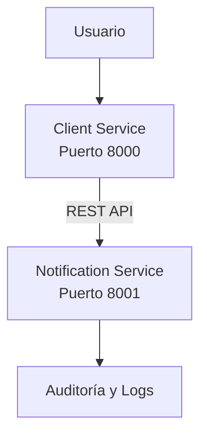

# ** Diseño de Arquitectura de Microservicios **
## **1. Descripción General**

La empresa Sky requiere una plataforma escalable basada en microservicios para la gestión de clientes, validación de datos, notificaciones y auditoría. La solución será desarrollada en Python y desplegada mediante contenedores Docker, utilizando integración y entrega continua con GitHub Actions.

La arquitectura propuesta sigue los principios de Domain-Driven Design (DDD), separando claramente las responsabilidades de cada servicio y permitiendo su escalabilidad independiente.

## **2. Arquitectura General**

**Diagrama de Arquitectura**

