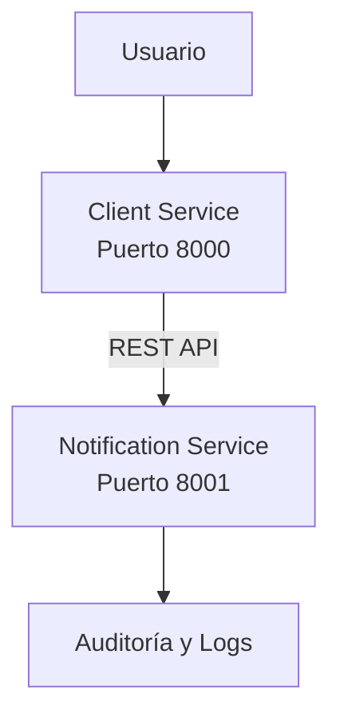
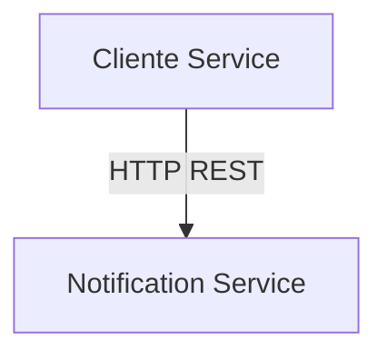
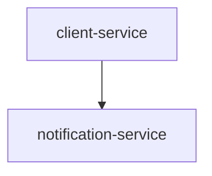

# ** Diseño de Arquitectura de Microservicios **
## **1. Descripción General**

La empresa Sky requiere una plataforma escalable basada en microservicios para la gestión de clientes, validación de datos, notificaciones y auditoría. La solución será desarrollada en Python y desplegada mediante contenedores Docker, utilizando integración y entrega continua con GitHub Actions.

La arquitectura propuesta sigue los principios de Domain-Driven Design (DDD), separando claramente las responsabilidades de cada servicio y permitiendo su escalabilidad independiente.

## **2. Arquitectura General**

**Diagrama de Arquitectura**

## **3. Microservicios Propuestos**

### **3.1 Client Service**

**Responsabilidad**

Gestionar toda la información relacionada con los clientes.

**Funciones**

-Registrar clientes.
-Consultar clientes.
-Actualizar clientes.
-Eliminar clientes.
-Validar datos de entrada.
-Solicitar generación de notificaciones.

**Puerto**

8000

**Contexto DDD**

Gestión de Clientes.

## **3.2 Notification Service**

**Responsabilidad**

Gestionar notificaciones y auditoría del sistema.

**Funciones**

-Generar notificaciones.
-Registrar eventos.
-Mantener historial de auditoría.
-Enviar mensajes a clientes.

**Puerto**

8001

**Contexto DDD**

Notificaciones y Auditoría.

## **4. Capas Internas de los Microservicios**

Cada microservicio seguirá una arquitectura en capas.

### **Capa Controller / Routes**

**Responsabilidades:**

Exponer endpoints REST.
Recibir solicitudes HTTP.
Validar parámetros básicos.

**Ejemplos:**

POST /clientes
GET /clientes/{id}

### **Capa Business Logic**

**Responsabilidades:**

-Aplicar reglas de negocio.
-Gestionar entidades y agregados.
-Ejecutar validaciones.

**Ejemplos:**

-Verificar RFC válido.
-Evitar registros duplicados.

### **Capa Data Access**

**Responsabilidades:**

-Persistencia de datos.
-Consultas a base de datos.
-Operaciones CRUD.

## **5. Comunicación Entre Servicios**

La comunicación se realizará mediante REST síncrono.

### **Flujo General**

El Client Service enviará solicitudes al Notification Service cuando ocurra un evento relevante.

Ejemplo:

- Cliente creado.
- Cliente actualizado.
- Cliente eliminado.

## **6. Casos de Uso**

### **Caso de Uso 1: Crear Cliente**

**Flujo**

- El usuario envía una solicitud de registro.
- Client Service valida los datos.
- Client Service almacena el cliente.
- Se genera el evento ClienteCreado.
- Client Service llama al Notification Service.
- Notification Service registra la auditoría.
- Notification Service genera una notificación.
- Se devuelve respuesta exitosa al usuario.

### **Caso de Uso 2: Enviar Notificación**

**Flujo**

- Notification Service recibe la solicitud.
- Se valida el mensaje.
- Se registra el evento en auditoría.
- Se almacena el historial.
- Se envía la notificación.
- Se devuelve confirmación.

## **7. Estrategia de Containerización con Docker**

### **Dockerfile Planificado para Client Service**

**Imagen Base**

python:3.12-slim

**Dependencias**

- FastAPI
- Uvicorn
- Pydantic
- Requests

**Puerto Expuesto**

8000

**Comando de Inicio**

uvicorn app.main:app --host 0.0.0.0 --port 8000

## **8. Diseño de docker-compose.yml**

**Servicios planificados:**

client-service
notification-service

**Puertos:**

8000:8000
8001:8001

**Red:**

sky-network

**Dependencias:**

